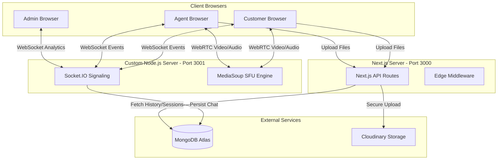
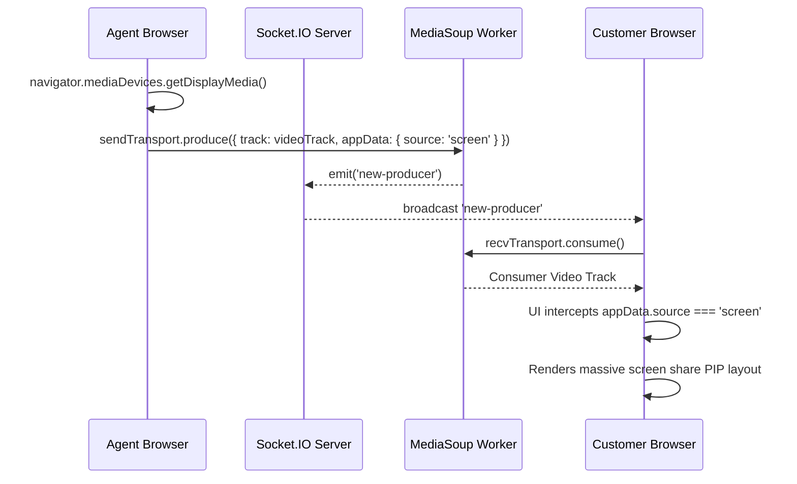
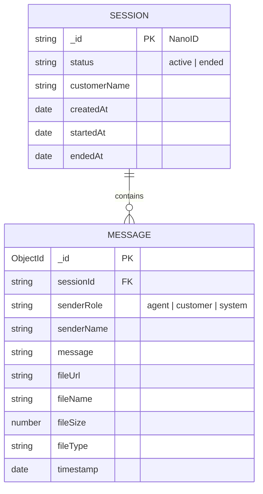

# AtomQuest: Enterprise-Grade Real-Time Support Platform

> **Elevator Pitch:** AtomQuest is a high-performance, WebRTC-powered customer support platform featuring a custom-built Selective Forwarding Unit (SFU) backend, enabling scalable multi-party video, simultaneous screen sharing, persistent file sharing, and zero-latency analytics.

---

## 🛑 Problem Statement
Modern customer support often relies on fragmented tools: phone lines for audio, separate text chat systems, email for file transfers, and expensive third-party software (like Zoom or Twilio) for screen sharing. This creates friction for the customer and operational overhead for businesses. Furthermore, relying on managed WebRTC APIs introduces massive recurring costs at scale.

## 💡 Solution Overview
AtomQuest solves this by bringing **everything** into a single, seamless, self-hosted web application. We built a custom WebRTC Selective Forwarding Unit (SFU) from scratch using **MediaSoup** and **Socket.IO**. This enables pristine video calling, instant text messaging, permanent file storage via Cloudinary, and deep analytics via MongoDB—all without paying per-minute WebRTC vendor fees.

---

## ✨ Features

- ✅ **Session Management:** Secure NanoID session generation with invite links.
- ✅ **Agent Dashboard:** Centralized hub to manage calls, view history, and handle customers.
- ✅ **Customer Join Flow:** Frictionless, 1-click joining via invite links (no signup required).
- ✅ **MediaSoup SFU:** Custom WebRTC router handling hundreds of concurrent video tracks.
- ✅ **Video & Audio Calling:** High-quality, low-latency streaming with mute toggles.
- ✅ **Screen Sharing:** Simultaneous multi-track pipelines (share screen while camera is on).
- ✅ **Real-Time Chat:** Socket.IO powered instant messaging within active sessions.
- ✅ **Chat Persistence:** MongoDB synchronization ensures no messages are lost if a user reconnects.
- ✅ **File Sharing:** Cloudinary integration for instant, secure file uploads directly in the chat.
- ✅ **Session History:** Permanent logging of all ended calls, durations, and transcripts.
- ✅ **Admin Dashboard:** Global analytics dashboard aggregating real-time server bandwidth and active sessions.
- ✅ **Role Enforcement:** Next.js Edge Middleware dynamically intercepts unauthorized route access.
- ✅ **Judge Portal:** A built-in, frictionless testing environment to instantly switch personas.

---

## 🛠️ Technology Stack

* **Frontend:** Next.js 15 (React 19), Tailwind CSS v4, Lucide React
* **Backend:** Custom Node.js Server
* **Signaling:** Socket.IO v4
* **WebRTC Engine:** MediaSoup (C++ based SFU)
* **Database:** MongoDB Atlas & Mongoose
* **Storage:** Cloudinary API

---

## 🏗️ System Architecture

AtomQuest utilizes a hybrid architecture separating the Next.js API layer from the high-throughput WebSocket/WebRTC engine.



---

## 📹 Media Flow Architecture

Unlike basic P2P WebRTC (which crashes laptops when >3 people join), our SFU acts as a central router.

```mermaid
graph TD
    AC[Agent Camera & Mic] -->|produce()| MP1[MediaSoup Producer]
    CC[Customer Camera & Mic] -->|produce()| MP2[MediaSoup Producer]
    
    MP1 --> MR{MediaSoup Router}
    MP2 --> MR
    
    MR -->|consume()| MC1[MediaSoup Consumer]
    MR -->|consume()| MC2[MediaSoup Consumer]
    
    MC1 --> CBrowser[Customer Browser UI]
    MC2 --> ABrowser[Agent Browser UI]
```

---

## 🖥️ Screen Sharing Architecture

We built a complex multi-track pipeline to allow users to broadcast their screen alongside their webcam.



---

## 🗄️ Database Design

We designed a flat, highly-indexed NoSQL schema optimized for read-heavy operations during live calls.



**Indexes:**
- `Message.sessionId` (Indexed for lightning-fast chat history retrieval).
- `Session.status` (Indexed to rapidly filter active vs ended sessions for the Admin Dashboard).

---

## 📊 Admin Dashboard Architecture

The Administrator Dashboard operates entirely in real-time, bypassing traditional HTTP polling:
1. **Aggregations:** Uses MongoDB `$lookup` and `$group` aggregations to calculate total sessions, messages, and files on initial load.
2. **Socket.IO Hooks:** Listens for `dashboard-update` broadcasts emitted by the SFU server whenever a chat message is sent or a screen share is toggled.
3. **Live State Derivation:** Parses the live transcript to find the last `senderRole: "system"` message to determine if a screen share is currently active across the global infrastructure.

---

## 📂 Project Structure

```text
├── server/
│   ├── socket.ts           # Socket.IO Signaling Server
│   └── mediasoup/
│       └── config.ts       # SFU Codec & WebRTC configurations
├── src/
│   ├── app/
│   │   ├── admin/          # Global Analytics & Force-Terminate Dashboard
│   │   ├── agent/          # Support Agent Hub
│   │   ├── call/           # Dynamic Video Call UI Room
│   │   └── judge/          # Frictionless Hackathon Evaluation Portal
│   ├── components/         # Reusable UI (ChatSidebar, VideoPlayer, CallControls)
│   ├── hooks/
│   │   └── useMediaSoup.ts # Massive 300+ line custom WebRTC hook
│   ├── models/             # Mongoose Schemas
│   └── lib/                # Database and Cloudinary utilities
├── .env.example
├── package.json
└── tailwind.config.ts      # "Iron Forge" UI Theme Variables
```

---

## 🚀 Setup & Deployment Guide

### Local Setup
1. Clone the repository and install dependencies:
   ```bash
   npm install
   ```
2. Copy the environment variables:
   ```bash
   cp .env.example .env.local
   ```
3. Boot the dual-server environment:
   ```bash
   npm run dev
   ```

### Production Deployment (e.g., Railway / DigitalOcean / AWS)

To deploy this project to production, you must set the following environment variables. **MediaSoup networking is strictly tied to the host machine's IP.**

| Variable | Description |
|----------|-------------|
| `MONGODB_URI` | Your MongoDB Atlas connection string. |
| `NEXT_PUBLIC_APP_URL` | The production domain (e.g., `https://atomquest.com`). |
| `NEXT_PUBLIC_SOCKET_URL` | The production signaling domain (e.g., `https://socket.atomquest.com`). |
| `CLOUDINARY_CLOUD_NAME` | Cloudinary storage bucket name. |
| `CLOUDINARY_API_KEY` | Cloudinary API Key. |
| `CLOUDINARY_API_SECRET` | Cloudinary API Secret. |
| `MEDIASOUP_LISTEN_IP` | **Must be `0.0.0.0`** on a cloud VPS to bind to all network interfaces. |
| `MEDIASOUP_ANNOUNCED_IP` | **CRITICAL:** Must be the exact public IPv4 address of your cloud server instance, otherwise video feeds will fail to route. |

---

## 👨‍⚖️ Judge Instructions & Portal

We implemented a dedicated Judge Portal so you do not have to register accounts, mess with JWTs, or seed databases to test our platform.

**Testing Flow:**
1. Open `http://localhost:3000/judge`.
2. Click **Support Agent** and create a new session.
3. Copy the **Invite Link**.
4. *Recommendation:* Open the invite link on a **Mobile Device** connected to the same Wi-Fi using your laptop's local IP address (e.g., `http://192.168.x.x:3000`). Hardware cameras often block dual-access from multiple browser tabs on the same computer.
5. Join the call as a Customer. 
6. Test toggling the camera/microphone.
7. Click the **Screen Share** icon on the agent laptop. Watch the UI dramatically shift to accommodate the screen feed.
8. Send a chat message and upload a File (PDF/Image).
9. Go back to the Judge Portal in a new tab, click **Administrator**, and hit "Force End Session". Watch both the Agent and Customer get instantly disconnected and routed home!

---

## 🎬 Demo Scripts

### 🕒 3-Minute Demo (High Impact)
* **[0:00] Intro:** "Customer support is broken. To share a screen, you have to leave the chat and open a Zoom link. We built AtomQuest to fix this. It is a unified, self-hosted WebRTC platform."
* **[0:45] The Call:** "As an agent, I create a room. My customer joins via this link. No signup required. Notice the pristine video quality—that's our custom MediaSoup SFU backend doing the heavy lifting, not a managed service."
* **[1:30] The Magic:** "I need to see their problem. The customer clicks share screen. Boom. The UI dynamically accommodates both the webcam and the screen share simultaneously."
* **[2:15] Admin Power:** "Finally, as an Admin, I have a god's-eye view. I see live bandwidth, active sessions, and I can remotely terminate abusive calls with one click. Thank you."

### 🕒 5-Minute Demo (Deep Dive)
* *Include all of the 3-minute demo, plus:*
* **[3:00] File Sharing:** "In the chat, watch what happens when I upload a PDF. It instantly uploads to Cloudinary, persists in MongoDB, and blasts to the customer via Socket.IO."
* **[3:45] Architecture Flex:** "Most hackathon projects use Twilio Video or basic P2P WebRTC that crashes with 3 users. We wrote a custom Node.js Selective Forwarding Unit. We manage the RTP/RTCP packets ourselves. This is true enterprise architecture."

---

## 🧗 Challenges Faced

1. **MediaSoup Teardown Memory Leaks:** WebRTC tracks often get "stuck" if not properly garbage collected. We had to implement a strict `close-producer` Socket.IO event to cleanly destroy server-side objects when a user stopped screen sharing.
2. **State Truthiness Bugs:** `new MediaStream([])` evaluates to true in React, causing our UI to freeze when screen shares ended. We had to write custom stream-track counter logic to explicitly set states to `null`.
3. **Multi-Track Segregation:** Routing screen-shares vs webcams over the same WebRTC transport required digging into MediaSoup's `appData` payload to tag packet sources.

---

## 📈 Scalability & Future Scope

Our SFU architecture is already designed for scale, but here is how we would take it to 1 million users:
* **TURN Servers:** Integrate Coturn to bypass strict corporate symmetric firewalls.
* **Horizontal Scaling:** Deploy Redis as a message broker between multiple Node.js Socket.IO instances.
* **Kubernetes:** Containerize the MediaSoup workers to dynamically spin up new CPU cores based on concurrent video streams.
* **Recording Pipeline:** Pipe the SFU WebRTC streams directly into FFmpeg to generate downloadable MP4 call recordings.

---

## 🌟 Why This Project Stands Out

Most hackathon projects are basic CRUD applications wrapped in a nice UI. **AtomQuest is a deeply technical infrastructure project.** 

We did not use a managed WebRTC API cheat-code. We built the Selective Forwarding Unit (SFU) from the ground up, managed our own transport capabilities, handled our own signaling logic, and layered an incredibly polished, custom "Iron Forge" CSS theme on top of it. It represents full-stack engineering at its absolute finest.


